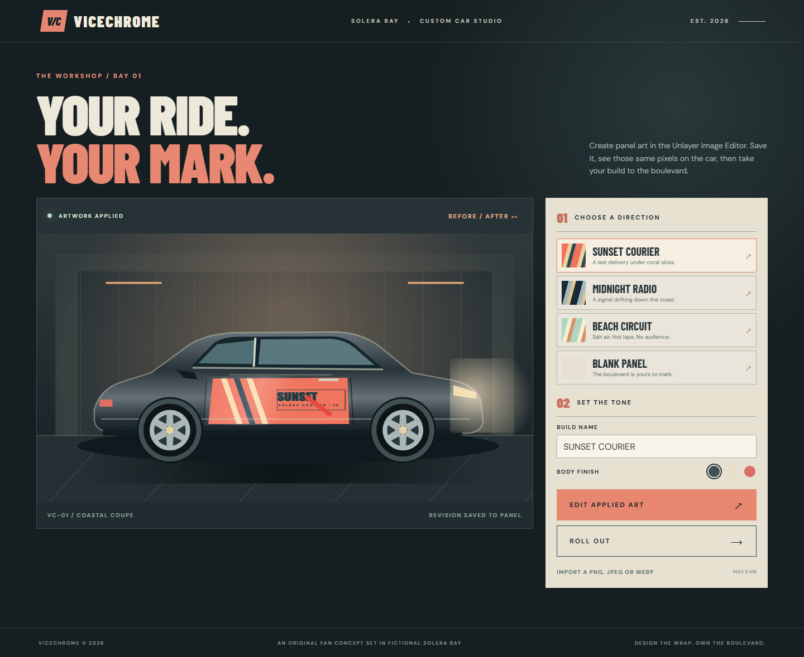

# VICECHROME



**[Live studio](https://tang-vu.github.io/vicechrome/)** · **[57-second demo](docs/evidence/vicechrome-demo.mp4)** · [Source](https://github.com/tang-vu/vicechrome)

**Design your mark. Own the boulevard.** VICECHROME is a GTA-inspired car art studio set in fictional Solera Bay. Choose an original commission or a blank panel, draw in the real [Unlayer React Image Editor](https://github.com/unlayer/react-image-editor), save, and see those pixels mapped onto an original illustrated coupe. Roll out into a dusk boulevard shot and download a 1600 × 2000 cover PNG or the flat panel image. The editable area is the **door panel**, not a full vehicle wrap.

| Before: original car | After: saved Unlayer mark |
| --- | --- |
|  |  |

## Run

Requires Node 20.19+ or 22.12+ and npm.

```bash
npm ci
npm run dev
```

Open the local URL printed by Vite. Run `npm run build`, `npm run typecheck`, and `npm run lint` for production checks. The browser scripts use Playwright and Chrome. Set `CHROME_PATH` if needed, or install Playwright Chromium. With the dev server running, run `npm run verify:browser`, `npm run verify:mobile`, `npm run verify:text`, and `node scripts/regressions.mjs`. Set `VICECHROME_URL` to exercise the deployed site.

## How the artwork reaches the car

The editor receives a 1000 × 335 starter bitmap or the latest applied image. Its desktop Save callback supplies `{ dataUrl, blob }`. VICECHROME validates the flattened result and fits those pixels without stretching through the fixed door-panel clipping path. Body shading and seams frame the artwork. The same renderer produces the garage, boulevard, and cover. Mobile provides a labeled Save action using the documented `getImage()` method; the tool workspace scrolls sideways at narrow widths so the canvas stays usable when settings expand.

Saved text and stickers are flattened; reopening edits pixels, not independent layers. Local PNG, JPEG, and WebP uploads are limited to 8 MB and 64–6000 pixels per side. They are fitted without cropping to the 1000 × 335 panel canvas, with pale margins when aspect ratios differ. Arbitrary valid dimensions saved by Unlayer are also contained within the panel without stretching. The latest revision lives in IndexedDB; build preferences live in localStorage. Storage failure leaves editing and downloads available during the current session.

The editor runtime loads from Unlayer's CDN, so internet access is needed. The app has no backend, account, API key, or paid runtime service. The optional AI Assistant is disabled. The original coupe and environments are code-drawn illustrations, not 3D or full-body customization.

This is an original fan concept. Solera Bay, VICECHROME, the car illustration, artwork, and copy are fictional and do not use Rockstar or GTA assets.

See [build notes](docs/BUILD_NOTES.md), [submission checklist](docs/SUBMISSION.md), [demo notes](docs/DEMO_SCRIPT.md), and [asset credits](docs/ASSETS.md).
